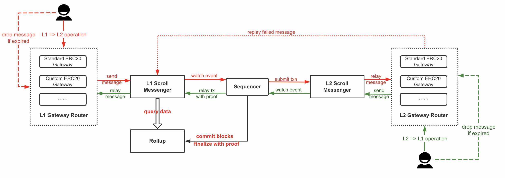

# Overview

The above picture is the overview of the contract design. There are several components both in layer 1 and layer 2: L1/L2 Scroll Messenger, various L1/L2 Gateways and L1/L2 Gateway Router. Besides these, there is a Rollup component only in layer 1.

The followings are the detailed docs for each component (docs are generated automatically by `@primitivefi/hardhat-dodoc` plugin):

- [L1 Scroll Messenger](./apis/L1ScrollMessenger.md) and [L2 Scroll Messenger](./apis/L2ScrollMessenger.md): Main entry for sending and relaying cross domain message.
- [Rollup](./apis/ZKRollup.md)
- [L1 Gateway Router](./apis/L1GatewayRouter.md) and [L2 Gateway Router](./apis/L2GatewayRouter.md): Router contract for depositing/withdrawing Ethers and ERC20 tokens.
- L1/L2 Gateways:
  - [L1 Standard ERC20 Gateway](./apis/L1StandardERC20Gateway.md) and [L2 Standard ERC20 Gateway](./apis/L2StandardERC20Gateway.md)
  - [L1 WETH Gateway](./apis/L1WETHGateway.md) and [L2 WETH Gateway](./apis/L2WETHGateway.md)
  - [L1 ERC721 Gateway](./apis/L1ERC721Gateway.md) and [L2 ERC721 Gateway](./apis/L2ERC721Gateway.md)
  - [L1 ERC1155 Gateway](./apis/L1ERC1155Gateway.md) and [L2 ERC1155 Gateway](./apis/L2ERC1155Gateway.md)
- [ScrollStandardERC20Factory](./apis/ScrollStandardERC20Factory.md): The `ScrollStandardERC20` token factory used by `L2StandardERC20Gateway`.

There are two main applications: Token Bridge and Cross Domain Messaging. You can find the documentations in the links below:

- [Token Bridge](./TokenBridge.md): moving token from layer 1 to layer 2, or from layer 2 to layer 1.
- [Cross Domain Messaging](./CrossDomainMessaging.md): sending data to layer 2 from layer 1, or sending data to layer 2 from layer 1. Basically, it will help to trigger function call cross layer. The token bridge also use cross domain messaging to achieve its functionality.
