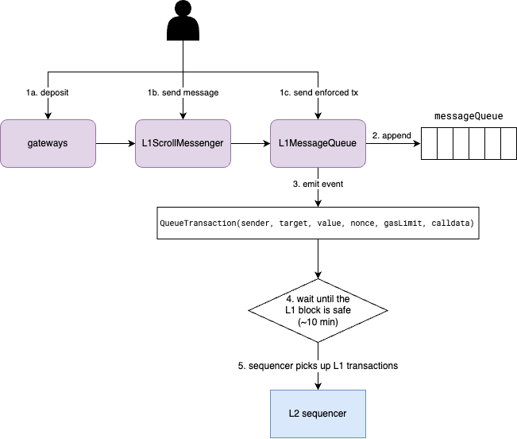
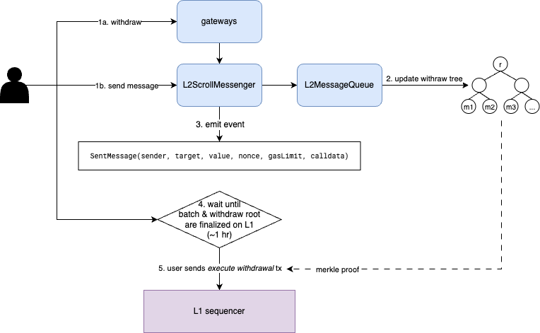

# Cross Domain Messaging

Scroll has an arbitrary message passing bridge that enables the token transfers and allows dapps to communicate between layer 1 and layer 2. This means that dapps on layer 1 can trigger contract functions on layer 2, and vice versa. Next, we will explain how the messages are relayed between layer 1 and layer 2.

**Table of Contents**
* [Send Message from L1 to L2](#send-message-from-l1-to-l2)
    * [Send Arbitrary Messages](#arbitrary-messages)
    * [Send Enforced Transaction](#send-enforced-transaction)
    * [Retry Failed Messages](#retry-failed-messages)
    * [L1 Message Transaction](#l1-message-transaction)
    * [Message Relay Fee](#message-relay-fee)
    * [Address Alias](#address-alias)
* [Send Message from L2 to L1](#send-message-from-l2-to-l1)
    * [Withdraw Trie](#withdraw-trie)


## Send Message from L1 to L2

<figure align="center">

<figcaption><b>Figure 1. L1 to L2 message relay workflow</b></figcaption>
</figure>

On L1, there are two major approaches to send a message to L2: sending arbitrary messages via `L1ScrollMessenger` and sending enforced transactions via `EnforcedTxGateway`.
Both approaches allow users to initiate a L2 transaction on L1 and call arbitrary contracts on L2.
The difference is that the sender of the L2 transactions for arbitrary messages and enforced transactions are the aliased `L1ScrollMessenger` contract address and an EOA account correspondingly.
In addition, we provide several standard token gateways to make users easier to deposit ETH and other standard tokens including ERC-20, ERC-677, ERC-721, and ERC-1155.
In essence, these gateways encode token deposits to a message and send it to the `L1ScrollMessenger` contract.
You can find more details about L1 token gateways in the [Deposit](Deposit.md) page.

As depicted in the Figure 1, both arbitrary messages and enforced transactions are appended to message queue stored in the `L1MessageQueue`.
The `L1MessageQueue` contract provides two function `appendCrossDomainMessage` and `appendEnforcedTransaction` for appending arbitrary messages and enforced transactions correspondingly.

```solidity
function appendCrossDomainMessage(address target, uint256 gasLimit, bytes calldata data) external;
function appendEnforcedTransaction(address sender, address target, uint256 value, uint256 gasLimit, bytes calldata data) external;
```

Both functions construct a L1-initiated transaction with a new transaction type `L1MessageTx` introduced in the Scroll chain and computes the transaction hash (see more details in the [L1 Message Transaction](#l1-message-transaction)).
`L1MessageQueue` appends the transaction hash to the message queue, and emits the event `QueueTransaction(sender, target, value, queueIndex, gasLimit, calldata)`.
The difference between `appendCrossDomainMessage` and `appendEnforcedTransaction` when constructing L1 message transactions is:
- `appendCrossDomainMessage` can be only called by `L1ScrollMessenger` and it uses the [aliased address](#address-alias) of `msg.sender` (the address of `L1ScrollMessenger`) as the transaction sender.
- `appendEnforcedTransaction` can be only called by `EnforcedTxGateway` and it uses `sender` from the function parameter as the transaction sender. This allows users to enforce a withdrawal or transfer of ETH from their L2 accounts from L1 bridge.

After the transaction is successfully executed on the L1, the watcher in the Scroll sequencer that monitors the `L1MessageQueue` contract will detect the new `QueueTransaction` events from L1 blocks.
The sequencer then generates a new `L1MessageTx` transaction per event and adds to the L1 transaction queue in the sequencer.
Every block time, the sequencer includes the transactions from both L1 transaction queue and L2 mempool to construct a new L2 block.
Note that the L1 message transactions must be included sequentially based on the L1 message queue order in the `L1MessageQueue` contract.
`L1MessageTx` transactions always come first in the L2 blocks followed by L2 transactions.
Currently, we limit the number of `L1MessageTx` transactions in a L2 block to `NumL1MessagesPerBlock` (TBD, likely 20).

Next, we will expand more on the sending arbitrary messages via `L1ScrollMessenger` and sending enforced transaction via `EnforcedTxGateway`.

### Send Arbitrary Messages

The `L1ScrollMessenger` contract provides two `sendMessage` functions to send arbitrary messages.
The only difference is that the second one allows users to specify a refund address other than the sender address to receive excessive fee.

<details>
<summary>Function signatures</summary>

```solidity
/// @param target The target address on L2.
/// @param value The value to deposit to L2 from `msg.value`.
/// @param message The message passed to target contract.
/// @param gasLimit The maximum gas can be used for this transaction on L2.
function sendMessage(
    address target,
    uint256 value,
    bytes memory message,
    uint256 gasLimit
) external payable;

/// @param target The target address on L2.
/// @param value The value to deposit to L2 from `msg.value`.
/// @param message The message passed to target contract.
/// @param gasLimit The maximum gas can be used for this transaction on L2.
/// @param refundAddress The address to refund excessive fee on L1.
function sendMessage(
    address target,
    uint256 value,
    bytes calldata message,
    uint256 gasLimit,
    address refundAddress
) external payable;
```
</details>
<br>

Both functions require users to provide a gas limit for the corresponding `L1MessageTx` transaction on L2 and prepay the [message relay fee](#message-relay-fee) on L1, which is calculated based on the gas limit amount.
The fee is collected to a `feeVault` contract on L1.
In case that a user doesn't set the correct gas limit for this message that leads to the transaction failure on L2, the user can replay the same message with a higher gas limit. You can find more details in the [Retry failed messages](#retry-failed-messages) section.

The `sendMessage` functions encode the arguments to a cross-domain message (see the code snippet below), where the message nonce is the next queue index of the L1 message queue. The encoded data is then used as calldata in the `L1MessageTx` transaction. Note that the cross-domain message calls the `relayMessage` function in the `L2ScrollMessenger` contract.

```solidity
abi.encodeWithSignature(
    "relayMessage(address,address,uint256,uint256,bytes)",
    _sender,
    _target,
    _value,
    _messageNonce,
    _message
)
```

The deposited ETH of `value` amount is frozen in the `L1ScrollMessenger` contract.
If the amount of ETH in the message cannot cover the message relay fee and deposited amount, the transaction will be reverted.
`L1ScrollMessenger` contract will refund the excessive amount to the designated `refundAddress` or the transaction sender otherwise.
Finally, `L1ScrollMessenger` appends the cross-domain message to `L1MessageQueue` via `appendCrossDomainMessage` method.

### Send Enforced Transaction

The `EnforcedTxGateway` contract provides two `sendTransaction` functions to send an enforced transaction.
In the first function, the sender of the generated `L1MessageTx` transaction is the transaction sender.
On the other hand, the second function uses the passed `sender` address as the sender of the `L1MessageTx` transaction.
This allows a third party to send an enforced transaction on behalf of the user and pay the relay fee.
Note that the second function requires to provide a valid signature of the generated `L1MessageTx` transaction that matches the `sender` address.
Both `sendTransaction` functions enforce the sender to be an EOA account.

<details>
<summary>Function signatures</summary>

```solidity
/// @param target The target address on L2.
/// @param value The value to withdraw from the `tx.origin` address on L2.
/// @param gasLimit The maximum gas can be used for this transaction on L2.
/// @param data The calldata passed to target contract.
function sendTransaction(
    address target,
    uint256 value,
    uint256 gasLimit,
    bytes calldata data
) external payable;

/// @param sender The sender address who will initiate this transaction on L2.
/// @param target The target address on L2.
/// @param value The value to withdraw from the `sender` address on L2.
/// @param gasLimit The maximum gas can be used for this transaction on L2.
/// @param data The calldata passed to target contract.
/// @param signature The signature for the corresponding `L1MessageTx` transaction.
/// @param refundAddress The address to refund excessive fee on L1.
function sendTransaction(
    address sender,
    address target,
    uint256 value,
    uint256 gasLimit,
    bytes calldata data,
    bytes memory signature,
    address refundAddress
) external payable;
```
</details>
<br>

Similar to arbitrary message relaying, `sendTransaction` estimates the message relay fee and deduct the fee to a `feeVault` account.
But differently, the `value` passed to the function indicates the amount of ETH to transfer from the L2 account.
Hence, the `msg.value` only needs to cover the [message relay fee](#message-relay-fee).
If the amount of ETH in the message cannot cover the fee, the transaction will fail.
The excess fee is refunded to the transaction sender in the first function and to the `refundAddress` in the second function.
At last, `EnforcedTxGateway` calls `L1MessageQueue.appendEnforcedTransaction` to append the transaction to the message queue.

### Retry Failed Messages

In the case of the failure of `L1MessageTx` transactions due to insufficient, users can replay the message with a higher gas limit.
There are two methods to replay the failed messages:
- On L1, `L1ScrollMessenger` provides a function `replayMessage` that allows users to send the same information as the previous failed message and a new gas limit. This message will become a new `L2MessageTx` transaction on L2. Note that we won't refund the gas fee for the previous failed transaction as it is already processed on L2.

    <details><summary>Function signature</summary>

    ```
    /// @param from The address of the sender of the message.
    /// @param to The address of the recipient of the message.
    /// @param value The msg.value passed to the message call.
    /// @param queueIndex The queue index for the message to replay.
    /// @param message The content of the message.
    /// @param newGasLimit New gas limit to be used for this message.
    /// @param refundAddress The address of account who will receive the refunded fee.
    function replayMessage(
        address from,
        address to,
        uint256 value,
        uint256 queueIndex,
        bytes memory message,
        uint32 newGasLimit,
        address refundAddress
    ) external payable;
    ```
    </details>
- On L2, `L2ScrollMessenger` also provides a retry function `retryMessageWithProof`. Similar to the `replayMessage` in the `L1ScrollMessenger`, users need to provide the same information as the original message. Differently, users also need to need to provide a Merkle Inclusion Proof (MIP) of the original message that proves its inclusion in the storage slot of the `L1ScrollMessenger` and a MIP of the `L1ScrollMessenger` contract to a valid state root of Ethereum.

    <details><summary>Function signature</summary>

    ```
    /// @param from The address of the sender of the message.
    /// @param to The address of the recipient of the message.
    /// @param value The msg.value passed to the message call.
    /// @param nonce The nonce of the message to avoid replay attack.
    /// @param message The content of the message.
    /// @param proof The message proof.
    function retryMessageWithProof(
        address from,
        address to,
        uint256 value,
        uint256 nonce,
        bytes calldata message,
        L1MessageProof calldata proof
    ) external;
    ```
    </details>

Because the `L2ScrollMessenger` contract records all successful relayed L1 messages, the transaction of the replayed or retried message will be reverted on L2 if the original message succeeded before.

### L1 Message Transaction

We introduce a new transaction type `L1MessageTx` in the Scroll chain for L1 initiated transactions.
The payload of `L1MessageTx` is defined below.
The `L1MessageTx` transaction type is `0x7E` and the encoding of `L1MessageTx` transactions is `0x7E || rlp([queue_index, gas_limit, target, value, data, sender])`.
Note that this transaction doesn't contain the signature because the transaction is constructed in the L1 contract which doesn't have access to the account secret key.

```go
type L1MessageTx struct {
	QueueIndex uint64          // The queue index of the message queue in L1 contract
	Gas        uint64          // gas limit
	To         *common.Address // can not be nil, we do not allow contract creation from L1
	Value      *big.Int
	Data       []byte
	Sender     common.Address
}
```

### Message Relay Fee

The contract `L2GasPriceOracle` deployed on the L1 computes the relay fee given the gas limit.
This contract stores the `l2BaseFee` in the contract, which is updated by a dedicated relayer run by Scroll currently.
The relay fee of L1-to-L2 messages is `gasLimit * l2BaseFee`.

### Address Alias

Due to the behavior of `CREATE` opcode, it is possible that someone deploys a contract at the same address on L1 and L2 but with different bytecode.
To avoid malicious users to take advantage of this, the bridge applies an address alias when the message sender is a contract on the L1.
The aliased sender address of the L1 message transaction is `l1_contract_address + offset` where the `offset` is `0x1111000000000000000000000000000000001111`.

## Send Message from L2 to L1

<figure align="center">

<figcaption><b>Figure 2. L2 to L1 message relay workflow</b></figcaption>
</figure>

On L2, users can send arbitrary messages through `L2ScrollMessenger` to withdraw tokens and call L1 contracts. Similar to L1, we have built several standard token gateways to make it easier to initialize token withdrawals. For more details about L2 token gateways, please refer to [Withdraw](Withdraw.md) page.

`L2ScrollMessenger` contract also provides a `sendMessage` function. The difference from the `L1ScrollMessenger.sendMessage` is that the `gasLimit` parameter is ignored in the function because the withdrawal execution transaction on L1 is submitted by users and the transaction fee is paid on L1 directly.
Thus, the `sendMessage` function requires `msg.value` equal to parameter `value`
The function encodes the arguments to a cross-domain message followed the same schema as [`L1ScrollMessenger`](#send-arbitrary-messages).

<details>
<summary>Function signatures</summary>

```solidity
/// @param target The target address on L1.
/// @param value The value to withdraw to L1 from `msg.value`.
/// @param message The message passed to target contract.
/// @param _gasLimit Ignored in the L2ScrollMessenger because the withdrawal execution on L1 is done by the user.
function sendMessage(
    address target,
    uint256 value,
    bytes memory message,
    uint256 _gasLimit
) external payable;
```
</details>
<br>

Next, the cross-domain message hash is appended to `L2MessageQueue` by calling `appendMessage` function.
The `L2MessageQueue` contract maintains the [Withdraw Trie](#withdraw-trie), an append-only Merkle tree.
Every time a new message is appended to the queue, the contract inserts it to the Withdraw Trie and updates the root hash.

The Bridge History API module monitors `SentMessage` events emitted from the `L2ScrollMessenger` and maintains a Withdraw Trie internally.
It is responsible for generating Merkle Inclusion Proofs (MIP) for every withdraw messages.
Later when the transaction batch along with the new state root and the new Withdraw Trie root are finalized on the L1 rollup contract, users can fetch the MIP from the Bridge History API and sends the *execute withdrawal* transaction to call `L1ScrollMessenger.relayMessageWithProof` to finalize the withdrawal on L1.
Because of MIPs, the finalization of withdrawal transactions on L1 is trustless.
Either users themselves or a third-party service can submit the execute withdrawal transactions on L1.

### Withdraw Trie

<figure align="center">

<figcaption><b>Figure 3. Withdraw Trie structure</b></figcaption>
</figure>

The Withdraw Trie is a dense binary Merkle tree. The hash of a leaf node inherits from the message hash, while the hash of a non-leaf node is the Keccak hash digest of the concatenated hashes of its two children.
The depth of the Withdraw Trie grows dynamically depending on the number of messages appended to the trie.
Figure 3(a) shows an example of a complete 3-layer withdraw trie.
When the number of leaves cannot saturate a complete binary tree, we pad leaf nodes with hash 0, as depicted in Figure 3(b) and 3(c).
When appending a new message to a non-complete Withdraw Trie, the padding node will be then replaced by a new leaf node with the actual message hash.
