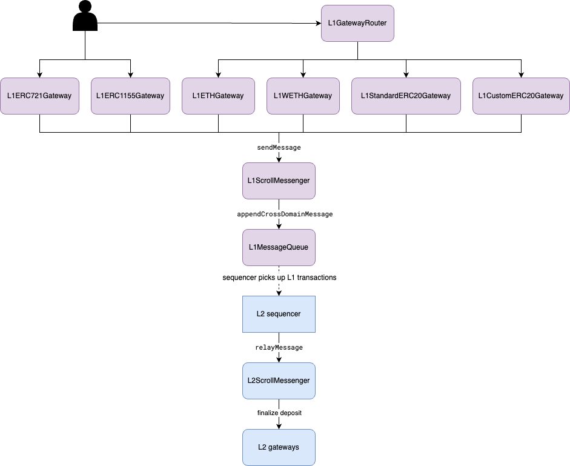

# Deposit Tokens from L1 to L2

**Table of Contents**
- [Deposit Tokens from L1 to L2](#deposit-tokens-from-l1-to-l2)
  - [Depositing ETH](#depositing-eth)
  - [Depositing ERC20 Tokens](#depositing-erc20-tokens)
    - [Standard ERC20 Tokens](#standard-erc20-tokens)
    - [Custom ERC20 Tokens](#custom-erc20-tokens)
    - [WETH Token](#weth-token)
  - [Depositing ERC-721/ERC-1155 Tokens](#depositing-erc-721erc-1155-tokens)


This document describes how users and developers can utilize gateways to deposit tokens from L1 to L2.
We provide several gateways for standard tokens and a gateway router on L1, listed in the table below.

| Gateway Contract         | Description                                                        |
|--------------------------|--------------------------------------------------------------------|
| `L1GatewayRouter`        | The gateway router supports the deposit of ETH and ERC20 tokens.   |
| `L1ETHGateway`           | The gateway to deposit ETH.                                        |
| `L1StandardERC20Gateway` | The gateway for standard ERC20 token deposits.                     |
| `L1CustomERC20Gateway`   | The gateway for custom ERC20 token deposits.                       |
| `L1WETHGateway`          | The gateway for Wrapped ETH deposits.                              |
| `L1ERC721Gateway`        | The gateway for ERC-721 token deposits.                            |
| `L1ERC1155Gateway`       | The gateway for ERC-1155 token deposits.                           |

The figure below depicts the deposit workflow from L1 to L2. Users call the gateways to initialize the token deposit.
The deposit is then encoded into a message sent to the `L1ScrollMessenger` contract and a corresponding L1-initiated transaction is appended to the `L1MessageQueue`.
To finalize the deposits on L2, the L2 sequencer collects the new L1 transaction events and includes the corresponding transactions in the L2 blocks it creates.
The subsequent sections describe the details of how different tokens are deposited.



## Depositing ETH

Scroll treats ETH as its native token.
We pre-allocate a sufficient amount of ETH to the `L2ScrollMessenger` contract in the genesis block so that it can transfer native ETH token to L2 accounts without minting.
Depositing ETH works as follows.

1. `L1GatewayRouter` provides three functions to deposit ETH from L1 to L2. The `depositETHAndCall` function can transfer ETH and execute a contract call at the same time.

    ```solidity
    function depositETH(uint256 _amount, uint256 _gasLimit) external payable;

    function depositETH(address _to, uint256 _amount, uint256 _gasLimit) public payable;

    function depositETHAndCall(address _to, uint256 _amount, bytes calldata _data, uint256 _gasLimit) external payable;
    ```

2. All three `depositETH` functions call into `L1ETHGateway`. `L1ETHGateway` encodes the deposit into a message sent to the `L1ScrollMessenger` contract.

3. The ETH of the deposit amount is locked in the `L1ScrollMessenger` contract. `L1ScrollMessenger` appends the message to the message queue in the `L1MessageQueue` contract.

4. After the deposit transaction is finalized on the L1, the sequencer will include a corresponding L2 transaction in the L2 block to finalize the deposit and transfer ETH to the recipient address on L2.

5. The L2 transaction calls the `L2ScrollMessenger.relayMessage` function, which executes the relayed message.
In the case of ETH deposit, the `relayMessage` function calls `L2ETHGateway.finalizeDepositETH` to transfer ETH to the recipient account on L2.

6. If the user calls `depositETHAndCall` on L1, `finalizeDepositETH` in the `L2ETHGateway` contract will forward the additional data to the target L2 contract.

## Depositing ERC20 Tokens

We use a similar design as [Arbitrum protocol](https://developer.offchainlabs.com/docs/bridging_assets#bridging-erc20-tokens). Several gateway contracts are used to bridge different kinds of ERC20 tokens, such as standard ERC20 tokens, custom ERC20 tokens, and Wrapped ETH token. `L1GatewayRouter` records the canonical mapping of ERC20 tokens to the corresponding ERC20 gateway on the L1.
`L1GatewayRouter` uses `StandardERC20Gateway` as the default ERC20 gateway for new ERC20 tokens unless a custom gateway is already set up.

The deposit of ERC20 tokens works as follows.

1. To deposit ERC20 tokens from L1 to L2, users can use `L1GatewayRouter.depositERC20` and `L1GatewayRouter.depositERC20AndCall` shown below.

    ```solidity
    function depositERC20(address _token, uint256 _amount, uint256 _gasLimit) external payable;

    function depositERC20(address _token, address _to, uint256 _amount, uint256 _gasLimit) external payable;

    function depositERC20AndCall(address _token, address _to, uint256 _amount, bytes memory _data, uint256 _gasLimit) public payable;
    ```

2. Based on the mapping from ERC20 tokens to gateway, the `L1GatewayRouter` calls to the corresponding gateway: `L1StandardERC20Gateway`, `L1CustomERC20Gateway`, or `L1WETHGateway`. The remaining of steps will be described separately.

### Standard ERC20 Tokens

Standard ERC20 tokens are tokens that do not require any custom logic.
For such tokens, their L2 ERC20 token contracts are created by `L2StandardERC20Gateway`.
The remaining steps for standard ERC20 token deposit are:

3. The `L1StandardERC20Gateway` contract locks the ERC20 tokens by transferring them from the sender to itself.

4. If this is the first time that this token is transferred through `L1StandardERC20Gateway`, `L1StandardERC20Gateway` will compute the deterministic ERC20 token address on L2 and update the `tokenMapping` in the contract. It also encodes the token metadata (symbol, name, and decimals) into the message for contract creation on L2.
If it's not the first time, `L1StandardERC20Gateway` directly fetches the L2 token address from the `tokenMapping`.

5. `L1StandardERC20Gateway` encodes the token deposit message and calls `L1ScrollMessenger` to send the message.

6. The corresponding L2 transaction calls the `L2ScrollMessenger.relayMessage` function to finalize the deposit on L2. In the case of standard ERC20 token deposits, the transaction then calls `L2StandardERC20Gateway.finalizeDepositERC20`.

7. If this is the first time that this ERC20 token is deposited on L2, `L2StandardERC20Gateway` extracts the token metadata from the message and calls `ScrollStandardERC20Factory` to deploy the standard ERC20 token on L2.

8. `L2StandardERC20Gateway` calls the mint function on the corresponding L2 ERC20 token contract.

9. If the user calls `depositERC20AndCall` on L1, the `L2StandardERC20Gateway` will call the target L2 contract with additional data.

### Custom ERC20 Tokens

In comparison to standard ERC20 tokens, the L2 contract of custom ERC20 tokens are deployed by the token owner. The remaining steps for custom ERC20 token deposit are:

3. The `L1CustomERC20Gateway` contract locks the ERC20 tokens on L1 by transferring them from the sender to itself.

4. `L1CustomERC20Gateway` requires a L2 ERC20 token address present in the `tokenMapping`. It retrieves the corresponding ERC20 token address, encodes the token deposit message, and forwards it to `L1ScrollMessenger`.

5. The corresponding L2 transaction calls the `L2ScrollMessenger.relayMessage` function to finalize the deposit on L2. In the case of custom ERC20 token deposits, the transaction calls `L2CustomERC20Gateway.finalizeDepositERC20`.

6. `L2CustomERC20Gateway` calls the mint function on the corresponding L2 ERC20 token contract. It is required that the L2 ERC20 token contract grants mint permissions to the `L2CustomERC20Gateway` contract.

7. If the user calls `depositERC20AndCall` on L1, the `L2CustomERC20Gateway` will call the target L2 contract with additional data.

### WETH Token

We provide a custom gateway `L1WETHGateway` for Wrapped ETH token on L1 and record the gateway address in the `L1GatewayRouter`. The deposit of WETH token works as follows.

3. `L1WETHGateway` locks the WETH tokens by transferring them from the sender to itself and unwrapping the WETH token to native ETH token. The ETH token and `msg.value` (for paying the relay fee) are then sent to the `L1ScrollMessenger` contract together.

4. `L1WETHGateway` encodes the token deposit message and forwards it to `L1ScrollMessenger`.

5. The corresponding L2 transaction calls the `L2ScrollMessenger.relayMessage` function to finalize the deposit on L2. In the case of WETH token deposit, the transaction calls `L2WETHGateway.finalizeDepositERC20`.

6. `L2WETHGateway` wraps the deposited ETH to L2 WETH token again and transfers it to the recipient address on L2.

7. If the user calls `depositERC20AndCall` on L1, the `L2WETHGateway` will call the target L2 contract with additional data.

## Depositing ERC-721/ERC-1155 Tokens

The deposit of ERC-721 or ERC-1155 tokens works very similar to ERC20 tokens. One can use the gateways `L1ERC721Gateway` or `L1ERC1155Gateway` to deposit ERC-721 /ERC-1155 tokens from L1.

```solidity
function depositERC721(address _token, uint256 _tokenId, uint256 _gasLimit) external payable;

function depositERC721(address _token, address _to, uint256 _tokenId, uint256 _gasLimit) external payable;

function depositERC1155(address _token, uint256 _tokenId, uint256 _amount, uint256 _gasLimit) external payable;

function depositERC1155(address _token, address _to, uint256 _tokenId, uint256 _amount, uint256 _gasLimit) external payable;
```

To facilitate a large amount of ERC-721 or ERC-1155 token deposits, we also provide batch deposit functions in the `L1ERC721Gateway` and `L1ERC1155Gateway` contract via the following functions:

```solidity
function batchDepositERC721(address _token, uint256[] calldata _tokenIds, uint256 _gasLimit) external payable;

function batchDepositERC721(address _token, address _to, uint256[] calldata _tokenIds, uint256 _gasLimit) external payable;

function batchDepositERC1155(address _token, uint256[] calldata _tokenIds, uint256[] calldata _amounts, uint256 _gasLimit) external payable;

function batchDepositERC1155(address _token, address _to, uint256[] calldata _tokenIds, uint256[] calldata _amounts, uint256 _gasLimit) external payable;
```

The L2 counterpart contracts for ERC-721 or ERC-1155 tokens are `L2ERC721Gateway` and `L2ERC1155Gateway`. These are used to finalize deposits on L2.
