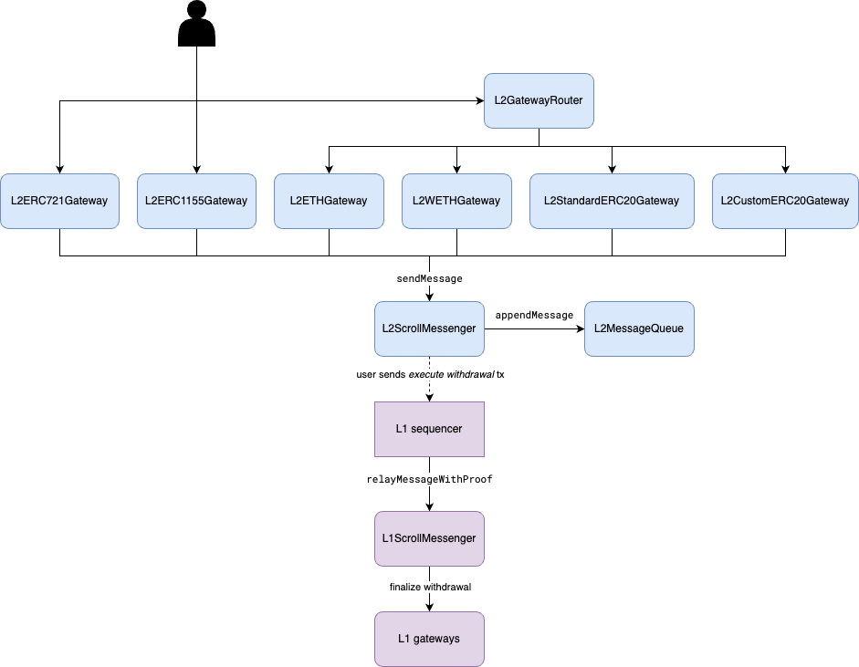

# Withdraw Tokens from L2 to L1

**Table of Contents**
* [Withdrawing ETH](#withdrawing-eth)
* [Withdrawing ERC20 Tokens](#withdrawing-erc20-tokens)
    * [Standard and Custom ERC20 Tokens](#standard-and-custom-erc20-tokens)
    * [WETH Token](#weth-token)
* [Withdrawing ERC-721/ERC-1155 Tokens](#withdrawing-erc-721erc-1155-tokens)

This document describes how users and developers can utilize gateways to withdraw tokens from L2 to L1.
We provide several gateways for standard tokens and a gateway router on L2, listed in the table below.

| Gateway Contract         | Description                                                        |
|--------------------------|--------------------------------------------------------------------|
| `L2GatewayRouter`        | The gateway router supports the withdrawal of ETH and ERC20 tokens.   |
| `L2ETHGateway`           | The gateway for  ETH withdrawals.                                        |
| `L2StandardERC20Gateway` | The gateway for standard ERC20 token withdrawals.                     |
| `L2CustomERC20Gateway`   | The gateway for custom ERC20 token withdrawals.                       |
| `L2WETHGateway`          | The gateway for Wrapped ETH withdrawals.                              |
| `L2ERC721Gateway`        | The gateway for ERC-721 token withdrawals.                            |
| `L2ERC1155Gateway`       | The gateway for ERC-1155 token withdrawals.                           |




The figure depicts the withdrawal workflow from L2 to L1. Users call the gateways to initialize the token withdrawal. The withdrawal is encoded into a message sent to the `L2ScrollMessenger`, which is then appended to the `L2MessageQueue`. `L2MessageQueue` maintains a Withdraw Trie and updates the root every time a new message appended. The Withdraw Trie root is finalized on the L1 rollup contract along with the L2 state root. After the new Withdraw Trie root is finalized on the L1, users or third parties can then construct a valid Merkle Inclusion Proof to the Withdraw Trie root and send a *withdraw execution* transaction to finalize the withdrawal on L1.
You can find more details about the cross domain message relay from L2 to L1 on the [Cross Domain Messaging](./CrossDomainMessaging.md) page.

The subsequent sections describe the details of how different tokens are withdrawn.

## Withdrawing ETH

The withdrawal of ETH token works as follows.

1. `L2GatewayRouter` provides three functions to withdraw ETH from L2 to L1. `withdrawETHAndCall` function can withdraw ETH and execute a contract call at the same time.

    ```solidity
    function withdrawETH(uint256 _amount, uint256 _gasLimit) external payable;

    function withdrawETH(address _to, uint256 _amount, uint256 _gasLimit) public payable;

    function withdrawETHAndCall(address _to, uint256 _amount, bytes calldata _data, uint256 _gasLimit) external payable;
    ```

2. The `withdrawETHAndCall` functions call into `L2ETHGateway`. `L2ETHGateway` encodes the withdraw message and sends it to the `L2ScrollMessenger` contract along with the withdrawn ETH.

3. The withdrawn ETH is again locked in the `L2ScrollMessenger` contract. `L2ScrollMessenger` appends the message to the message queue in the `L2MessageQueue` contract.

4. The withdrawal execution transaction on L1 calls the `L1ScrollMessenger.relayMessageWithProof` function to finalize the withdrawal.
In the case of ETH withdrawal, the `relayMessageWithProof` function calls `L1ETHGateway.finalizeWithdrawETH` to send back ETH to the recipient account on L1.

5. If the user calls `withdrawETHAndCall` on L2, the `finalizeWithdrawETH` in the `L1ETHGateway` contract will forward the additional data to the target L1 contract.

## Withdrawing ERC20 Tokens

The withdraw of ERC20 tokens works as follows.

1. To withdraw ERC20 tokens from L1 to L2, users can use `L2GatewayRouter.withdrawERC20` and `L2GatewayRouter.withdrawERC20AndCall` showed below.

    ```solidity
    function withdrawERC20(address _token, uint256 _amount, uint256 _gasLimit) external payable;

    function withdrawERC20(address _token, address _to, uint256 _amount, uint256 _gasLimit) external payable;

    function withdrawERC20AndCall(address _token, address _to, uint256 _amount, bytes memory _data, uint256 _gasLimit) public payable;
    ```

2. Based on the mapping from ERC20 tokens to gateway, the `L2GatewayRouter` calls to the corresponding gateway, `L2StandardERC20Gateway`, `L2CustomERC20Gateway`, or `L2WETHGateway`. The remaining of steps will be described separately.

### Standard and Custom ERC20 Tokens

The withdrawal of standard and custom ERC20 tokens works in the same way as follows.

3. The `L2StandardERC20Gateway` or `L2CustomERC20Gateway` contract burns the withdrawn ERC20 token, encodes the withdrawal into a message, and sends it to `L2ScrollMessenger`.

4. The L1 withdrawal execution transaction calls `L1ScrollMessenger.relayMessageWithProof` function to finalize the withdrawal on L1. In the case of standard or custome ERC20 token withdrawal, the transaction calls `finalizeWithdrawERC20` function on the `L1StandardERC20Gateway` or `L1CustomERC20Gateway` contract respectively.

5. The L1 ERC20 token gateway releases the locked ERC20 tokens by transferring them from itself to the recipient address on L1.

6. If the user calls `withdrawERC20AndCall` on L2, the gateways will call the target L1 contract with additional data.

### WETH Token

We provide a custom gateway `L2WETHGateway` for Wrapped ETH token on L2 and record the gateway address in the `L2GatewayRouter`. The withdrawal of WETH token works as follows.

3. `L2WETHGateway` transfers the withdrawn WETH token to itself and unwraps WETH token to native ETH token. The ETH token is then sent back to the `L2ScrollMessenger` contract.

4. `L2WETHGateway` encodes the token withdrawal message and forwards it to `L2ScrollMessenger`.

5. The L1 withdrawal execution transaction calls `L1ScrollMessenger.relayMessageWithProof` function to finalize the withdrawal on L1. In the case of WETH token withdrawal, the transaction calls `L1WETHGateway.finalizeWithdrawERC20` and sends the withdrawn amount in ETH to `L1WETHGateway`.

6. `L1WETHGateway` wraps the withdrawn ETH to L1 WETH token again and transfers to the recipient address on L1.

7. If the user calls `withdrawERC20AndCall` on L2, the `L1WETHGateway` will call the target L1 address with additional data.

## Withdrawing ERC-721/ERC-1155 Tokens

The withdrawal of ERC-721 or ERC-1155 tokens works very similar to ERC20 tokens. One can use the gateway `L2ERC721Gateway` or `L2ERC1155Gateway` to withdraw ERC-721 /ERC-1155 tokens from L2.

```solidity
function withdrawERC721(address _token, uint256 _tokenId, uint256 _gasLimit) external payable;

function withdrawERC721(address _token, address _to, uint256 _tokenId, uint256 _gasLimit) external payable;

function withdrawERC1155(address _token, uint256 _tokenId, uint256 _amount, uint256 _gasLimit) external payable;

function withdrawERC1155(address _token, address _to, uint256 _tokenId, uint256 _amount, uint256 _gasLimit) external payable;
```

To facilitate a large amount of ERC-721 or ERC-1155 token withdrawals, we also provide batch withdraw functions in the `L2ERC721Gateway` and `L2ERC1155Gateway` contract via the following functions:

```solidity
function batchWithdrawERC721(address _token, uint256[] calldata _tokenIds, uint256 _gasLimit) external payable;

function batchWithdrawERC721(address _token, address _to, uint256[] calldata _tokenIds, uint256 _gasLimit) external payable;

function batchWithdrawERC1155(address _token, uint256[] calldata _tokenIds, uint256[] calldata _amounts, uint256 _gasLimit) external payable;

function batchWithdrawERC1155(address _token, address _to, uint256[] calldata _tokenIds, uint256[] calldata _amounts, uint256 _gasLimit) external payable;
```

The L1 counterpart contracts for ERC-721 or ERC-1155 tokens are `L1ERC721Gateway` and `L1ERC1155Gateway` to finalize withdrawals on L1.
